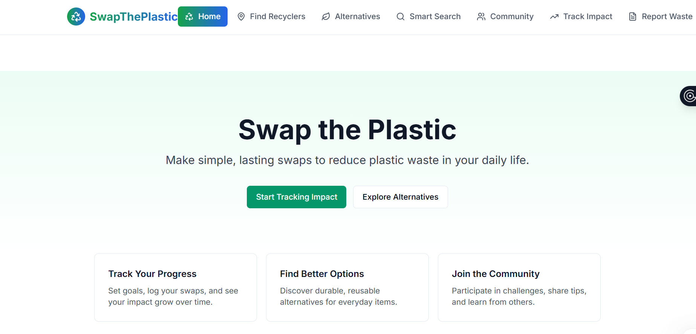
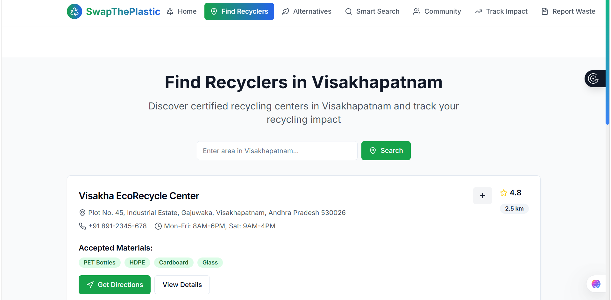
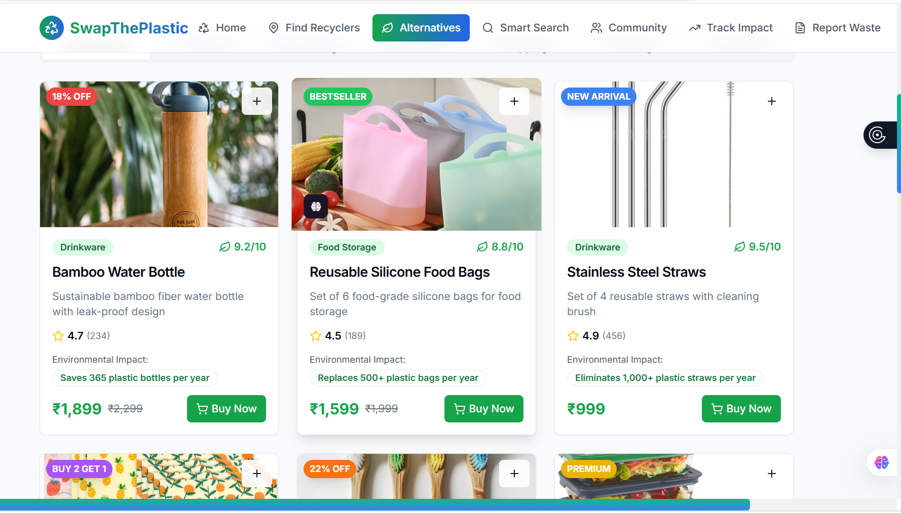
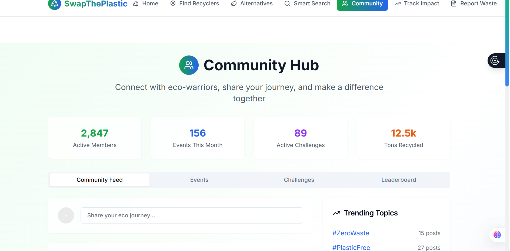

# A full-stack AI-powered platform promoting eco-friendly living and plastic waste management.

# 🌱 Swap the Plastic – Eco-Friendly Awareness & Recycling Platform

## 🔗 Live Demo

👉 https://swap-the-plastic-website.vercel.app/


## 📌 Problem Statement

Plastic pollution is a major environmental issue. Many people are unaware of:

* Nearby recycling centers
* Eco-friendly alternatives
* Proper waste disposal methods

There is no simple platform connecting users with recyclers and sustainable choices.


## 💡 Solution

**Swap the Plastic** is a web-based platform that helps users:

* Find nearby recyclers
* Discover eco-friendly product alternatives
* Request plastic waste pickup
* Get rewards or suggestions from recyclers


## 🚀 Features

* ♻️ Recycler Finder (with location/map support)
* 🌿 Eco-friendly product alternatives
* 📦 Plastic waste pickup request system
* 🎁 Reward/response system from recyclers
* ❤️ Wishlist & user interaction features
* 🔍 Search & filter functionality
* 🤖 ML-based smart recommendations (KNN)


## 🛠️ Tech Stack

* **Frontend:** HTML, CSS, JavaScript
* **Backend:** Flask (Python)
* **Machine Learning:** KNN Algorithm
* **Deployment:** Vercel


## How It Works

1. User visits the platform
2. Searches for eco-friendly products or recyclers
3. Submits pickup request with plastic details
4. Recycler responds with reward/solution
5. System suggests better alternatives using ML


## 📸 Screenshots

## 📸 Screenshots

### 🏠 Homepage


### 🔍 Recycler Finder


### 🌿 Products

###  Community



## ⚙️ Installation & Setup

```bash
git clone https://github.com/your-username/swap-the-plastic.git
cd swap-the-plastic
pip install -r requirements.txt
python app.py


## 🎯 Future Enhancements

* 🔐 User authentication (Google Login)
* 💳 Payment integration
* 📍 Live location tracking
* 📱 Mobile app version

---

##  Author

**Meghana Gunnam**

* B.Tech Student | AI/ML Enthusiast
* Passionate about sustainability & technology


##  Impact

This project supports environmental sustainability by:

* Reducing plastic waste
* Promoting eco-friendly products
* Connecting users with recycling systems


⭐ If you like this project, give it a star on GitHub!

